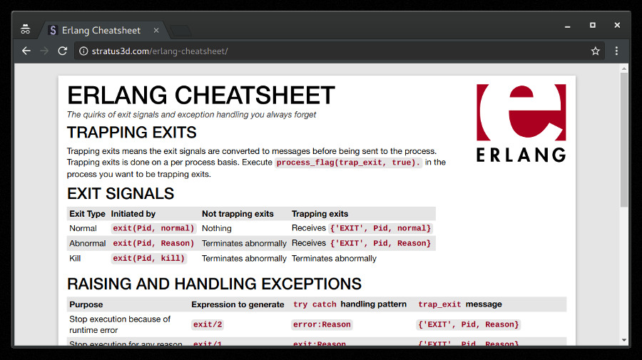

# Erlang Cheatsheet

The quirks of exit signals and exception handling you always forget.

See the Cheatsheet here: https://stratus3d.com/erlang-cheatsheet

## Contributing

Feel free to create an issue or pull request if you find a mistake or see something that could be improved.

## Development

Sass is used for the stylesheets. Dependencies are specified in the Gemfile. Makefile contains targets to build the final page and place it in `build/`.

## LICENSE

MIT License
